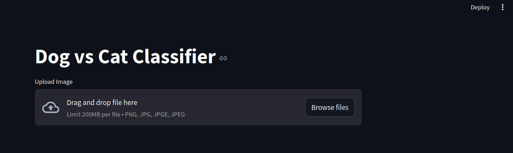
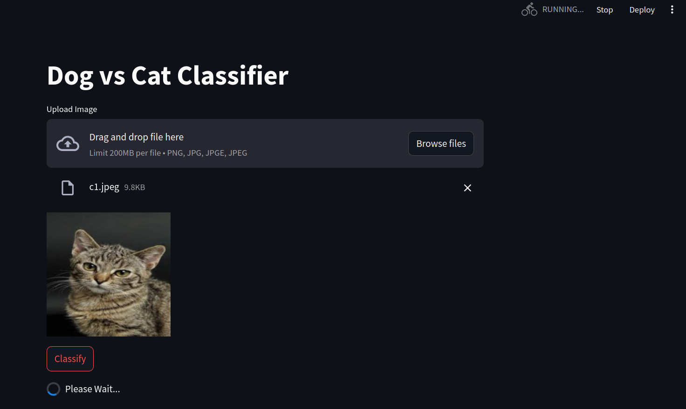
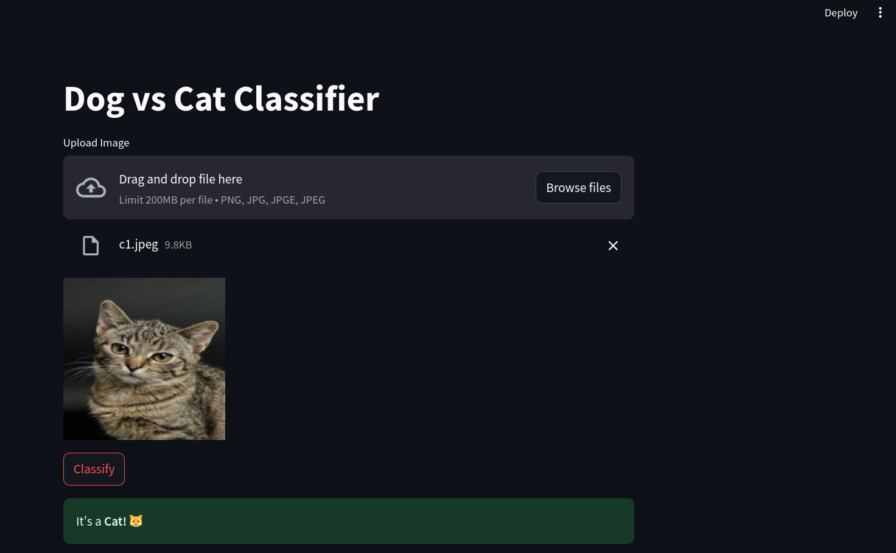
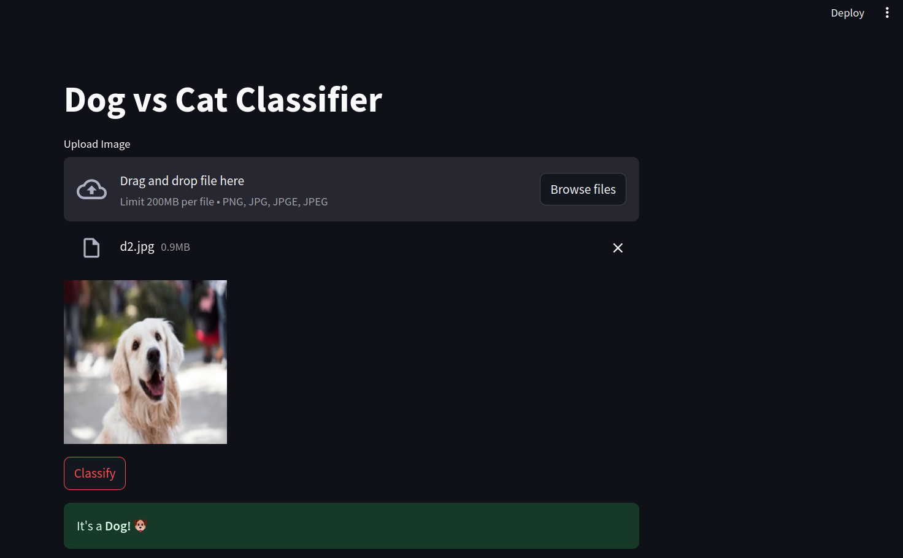

# Cat vs Dog Classifier

 Model Link: https://huggingface.co/spaces/ujjwal-7531/DogVsCat_Classifier

## About the Project
The **Cat vs Dog Classifier** is a machine learning project designed to classify images as either a dog or a cat. It leverages advanced neural network techniques and provides an interactive interface for users to upload images directly from their local storage for classification.

## Features
- **Interactive Interface**: Built using Streamlit for a smooth and user-friendly experience.
- **Image Classification**: Accurately classifies images as either a dog or a cat.
- **Real-Time Processing**: Allows users to upload and classify images in real time.

## Key Technologies Used
- **TensorFlow**: For building and training the neural network models.
- **Convolutional Neural Networks (CNN)**: Implemented for precise image classification.
- **MaxPooling**: Used for downsampling feature maps in the CNN layers.
- **Artificial Neural Networks (ANN)**: Utilized for extracting features from images.
- **Streamlit**: Employed for deploying the model with an interactive UI.

## How It Works
1. **Image Upload**: Users can upload an image via the Streamlit interface.
2. **Preprocessing**: The uploaded image is resized and normalized for model compatibility.
3. **Prediction**: The trained CNN model predicts the category (dog or cat) with high accuracy.
4. **Result Display**: The classification result is displayed alongside the uploaded image.

## Visuals from the model
- ### Interface

- ### Selecting Image

- ### Result 1

- ### Result 2

